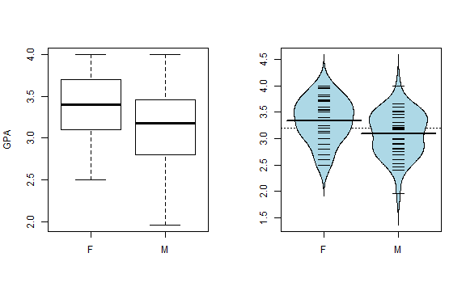
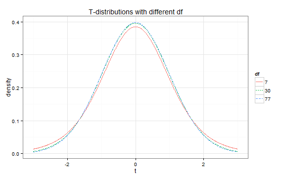
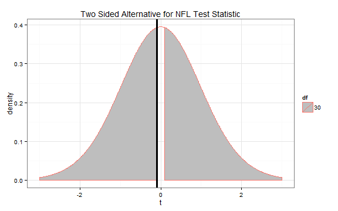
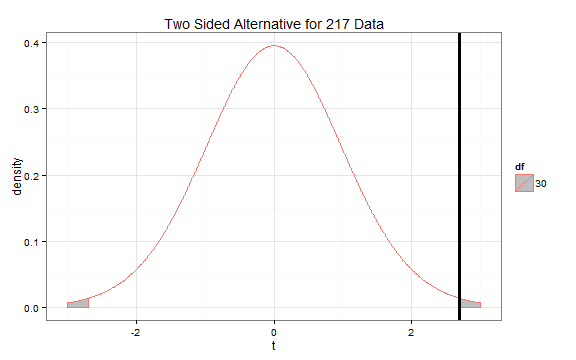

In this activity we will be working with two data sets: one containing data on scoring rates of NFL teams and one containing data on GPA and gender from former 217 students.  I will work through the steps of a hypothesis test and confidence interval for the nfl data while asking you to do so for the 217 students.

Once you have worked your way through the assignment, answer the take home questions and turn them in to me.  Half the points will be participation for working through this assignment.  The other half will be for the take home questions.  **Please do this as a group and just turn in one for the whole group.**

--- 
## NFL Data

Each team in the NFL is part of one of two conferences.   We will test to see if teams in one conference score more than teams in the other on average.  Looking at the boxplots, it appears that the AFC might score slightly more.


```r
nfl <- read.csv("path-to-nfl-stats-data-on-your-computer")
par(mfrow = c(1,2)) # put two plots per row
require(mosaic)
boxplot(PTS.G ~ Conference, data = nfl, ylab = "Points per Game")
require(beanplot)
beanplot(PTS.G ~ Conference, data = nfl, 
         log = "", col = "lightblue", method = "jitter")
```


---
## 217 Data

In a previous semester, some of the Stat 217 students provided information on their gender and current GPA.  The data are plotted below.


```r
s217 <- read.csv("http://dl.dropboxusercontent.com/u/77307195/s217.csv")
par(mfrow = c(1,2))
boxplot(GPA ~ Sex, data = s217, ylab = "GPA")
beanplot(GPA ~ Sex, data = s217, log = "", col = "lightblue", method = "jitter")
```



---
## NFL Hypotheses

For the NFL data, we want to see if there is a difference in the average points per game (PTS.G) in the two conferences.  So we will use a "not equal to" alternative.

$H_0: \mu_{AFC} = \mu_{NFC}$

$H_A: \mu_{AFC} \neq \mu_{NFC}$

--- &radio
## 217 Hypotheses

For the 217 data, which of the following sets of hypotheses is correct to test if the average GPA for men and women is different?

1. $H_0: \mu_{men} = \mu_{women}$; $H_A: \mu_{men} < \mu_{women}$
2. _$H_{0}: \mu_{men} = \mu_{women}; \, H_{A}: \mu_{men} \neq \mu_{women} $_
3. $H_0: \mu_{men} = \mu_{women}$; $H_A: \mu_{men} > \mu_{women}$
4. none of these are correct

*** .hint
Which hypothses suggests the two groups are different?

---
## NFL Assumptions

We have no reason to suspect the independence assumption might not be met.

Looking back at the plots, it appears that the AFC might have a larger spread than the NFC.  But the difference is not too large compared to some data sets.  Our book gives a rule of thumb for these situations that if the **ratio of the larger standard deviation over the smaller standard deviation is less than 2, the equal variance assumption is okay**.  Looking at some summary statistics, the rule of thumb suggests that the equal variance assumption is probably okay.


```r
favstats(PTS.G ~ Conference, data = nfl)
```

```
#>   .group  min   Q1 median   Q3  max mean   sd  n missing
#> 1    AFC 15.6 18.4   22.5 26.0 30.1 22.5 4.85 16       0
#> 2    NFC 17.3 19.8   20.8 24.7 30.4 22.7 4.14 16       0
```

The normality assumption is valid as well.  Just trust me, these plots are as good as anything you will ever see with real data.

--- &checkbox
## 217 Assumptions

Using the plots from before and these summary statistics, which assumptions do not appear to be valid for the 217 data?  Select all that apply.


```r
favstats(GPA ~ Sex, data = s217)
```

```
#>   .group  min  Q1 median   Q3 max mean    sd  n missing
#> 1      F 2.50 3.1   3.40 3.70   4 3.34 0.407 37       0
#> 2      M 1.96 2.8   3.17 3.46   4 3.09 0.415 42       0
```


1. Independence
2. Equal Variance
3. Normality
4. _All of the assumptions are valid_

*** .hint
When assessing the assumptions, we are mostly looking to see if any are **really badly** violated.

---
## NFL Test Statistic

Based on the output from a two sided t-test in R, the test statistic is -0.102.  Under the null, it follows a t-distribution with 30 degrees of freedom which yields a p-value of 0.9195.


```r
t.test(PTS.G ~ Conference, data = nfl, var.equal = T, alternative = "two.sided")
```

```
#> 
#> 	Two Sample t-test
#> 
#> data:  PTS.G by Conference
#> t = -0.102, df = 30, p-value = 0.9195
#> alternative hypothesis: true difference in means is not equal to 0
#> 95 percent confidence interval:
#>  -3.42  3.10
#> sample estimates:
#> mean in group AFC mean in group NFC 
#>              22.5              22.7
```

--- &multitext
## 217 Test Statistic

1. Using the output below, what is the test statistic for the 217 data?


```r
t.test(GPA ~ Sex, data = s217, var.equal = T, alternative = "two.sided")
```

```
#> 
#> 	Two Sample t-test
#> 
#> data:  GPA by Sex
#> t = 2.69, df = 77, p-value = 0.008713
#> alternative hypothesis: true difference in means is not equal to 0
#> 95 percent confidence interval:
#>  0.065 0.435
#> sample estimates:
#> mean in group F mean in group M 
#>            3.34            3.09
```

*** .hint
Which line of the output corresponds to the **t**-statistic?

*** .explanation
1. <span class='answer'>2.69</span>

--- &radio
## 217 Null Distribution

What distribution does the test statistic follow under the null hypothesis?

1. $\sim t(95)$
2. $\sim N(95)$
3. $\sim N(0, 1)$
4. _$\sim t(77)$_

*** .hint
It is a **t** test and degrees of freedom are commonly referred to as *df*

---
## The T-distribution

When doing a t-test, we compare our test statistic to the t-distribution.  The t-distribution is unimodal and symmetric, but its spread depends on the degrees of freedom.  As the degrees of freedom increases, the distribution becomes more concentrated around 0.



We want to compare the test statistic for the NFL data to the t-distribution with 30 df.


We can use the `pt` command in R to compare the test statistic to the t-distribution to obtain a p-value.  If we had a less than alternative, we'd use the following code.


```r
pt(-0.102, df = 30, lower.tail = TRUE)
```

```
#> [1] 0.46
```

This yields a p-value of 0.46.  That is the area of the t-distribution that is shaded grey below.


However, we are performing a not equal to (or two-sided) alternative.  This means we need to account for both positive and negative test statistics that are more extreme.



Since the t-distribution is symmetric, we can double the one sided p-value to obtain the two sided p-value.  We can obtain this p-value using R


```r
2 * pt(-0.102, df = 30, lower.tail = TRUE)
```

```
#> [1] 0.919
```

--- &multitext
## 217 P-value

For the 217 data we are using a two-sided alternative.  So we want to obtain a p-value as below.



1. Using R, obtain the p-value for the 217 data (you may need to go back to the *217 Test Statistic* section to find the test statistic and the df).  Round to three decimal places.

*** .hint
Your code should look like `2 * pt(teststat, df, lower.tail = FALSE)`

*** .explanation
1. <span class='answer'>0.009</span>

---
## NFL Decision

We'll use a significance level of 0.05.  The p-value is 0.919 which is greater than the significance level so we fail to reject the null.

--- &radio
## 217 Decision

What is your decision for the 217 data?  Use a significance level of 0.05.

1. _Reject the null_
2. Accept the null
3. Fail to reject the null
4. none of the above

*** .hint
The p-value is less than the significance level.

---
## NFL Conclusion and Scope of Inference

The evidence does not suggest that the true mean scoring rate is different in the NFC and AFC.  These data were a convenience sample from 2014 so we cannot say that these results do not extend to all NFL seasons.  Teams are not randomly assigned to conferences so we cannot make causal inferences for these data.

---
## Take Home Questions

1. Write a conclusion for the 217 Hypothesis test in the context of the problem.
2. State the scope of inference for the 217 data.  
3. The estimated difference in means for the 217 data is 0.25 and the standard error is 0.09.  Construct a 95% confidence interval using a critical value of 2.
4. Interpret the confidence interval in the context of the problem.  For example, here's how I would interpret the conidence interval for the NFL data:
  - "We are 95% confident that the true mean scoring rate for teams in the AFC is between 3.4 points higher and 3.1 points lower than the true mean scoring rate for teams in the NFC."
5. Look back at the boxplot and beanplot of the NFL data.  The boxplot shows that the median scoring in the AFC is higher, but the beanplot shows that the mean scoring in the NFC is slightly higher.  Why might this be? (Hint: think back to the difference between mean and median.)
6. I have been unable to come up with a better name for these exercises where I make a web page and have you work through it.  Suggest one here.  A bonus point if you make me laugh (must be appropriate).


